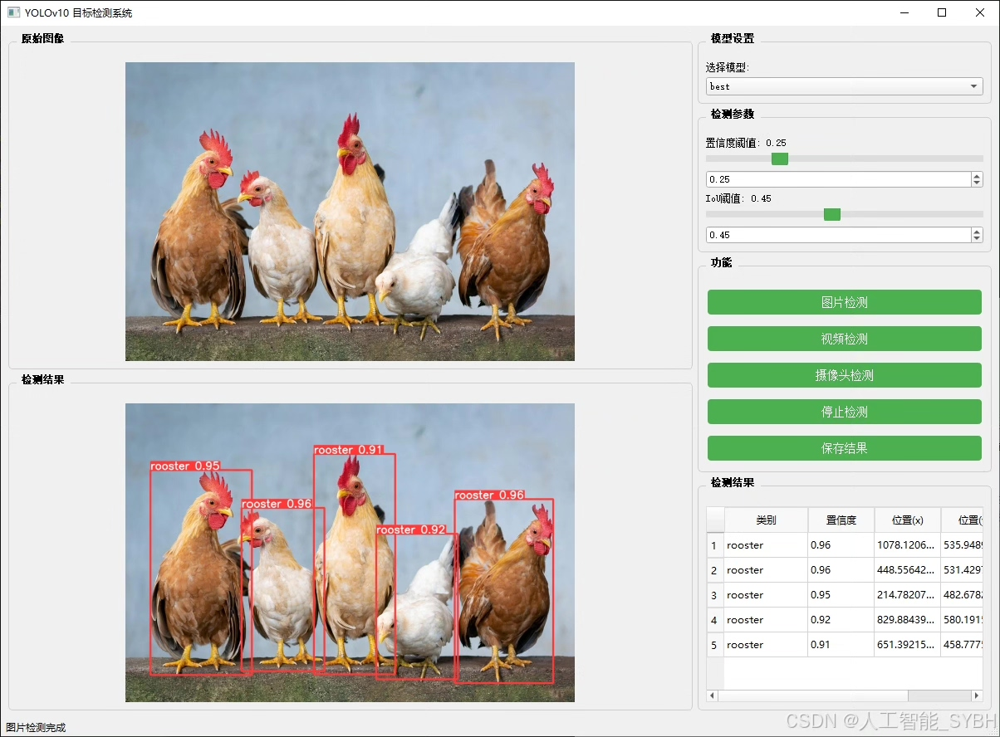
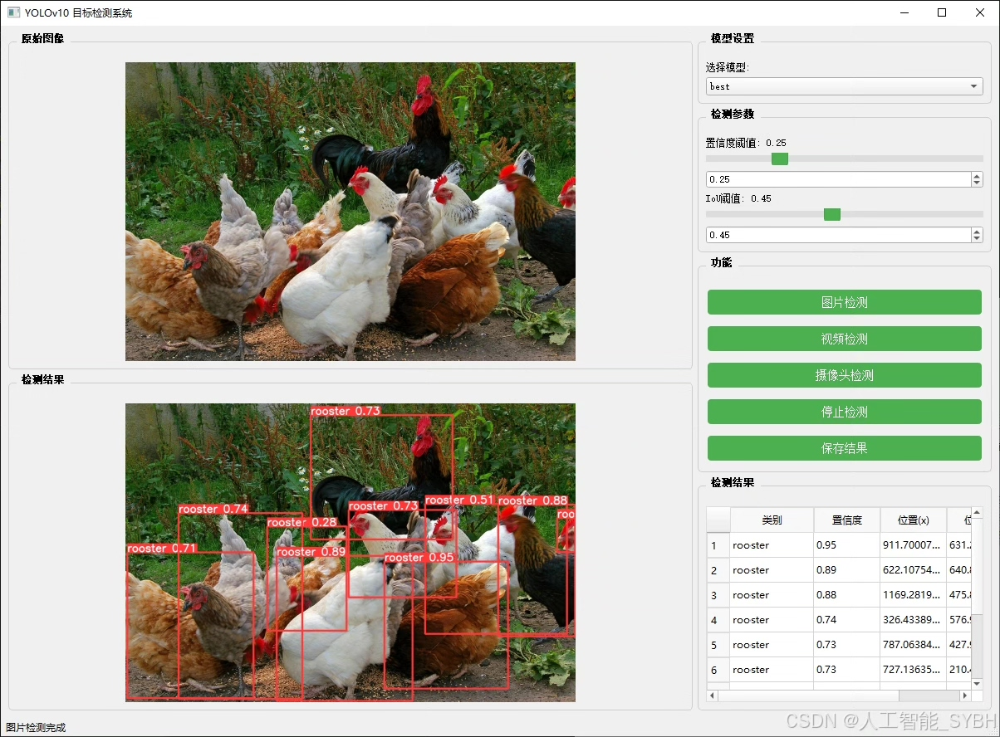
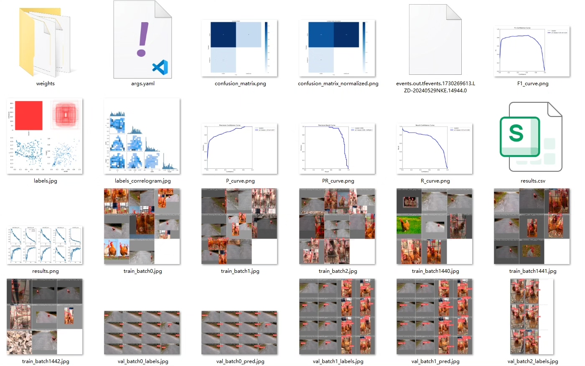
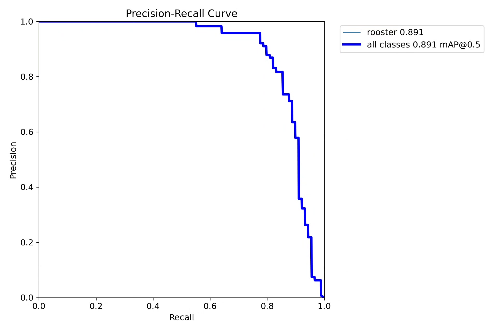
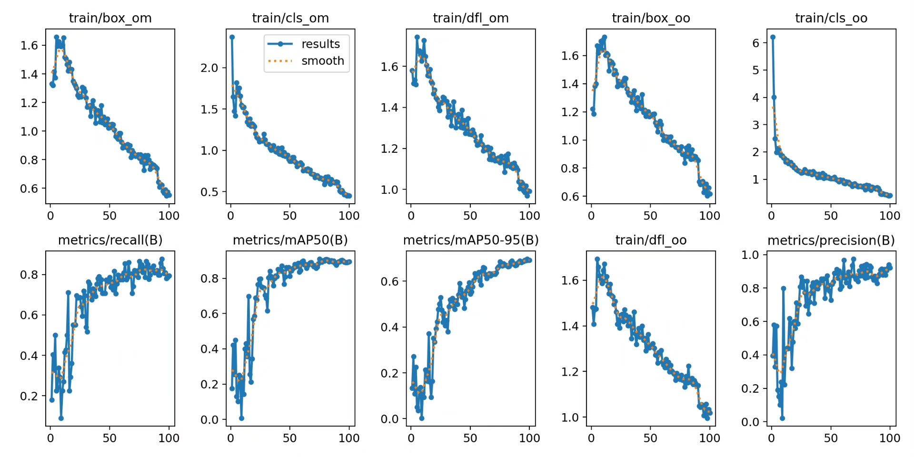
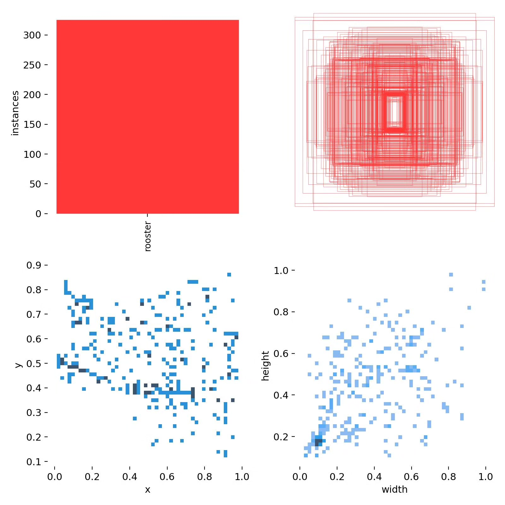
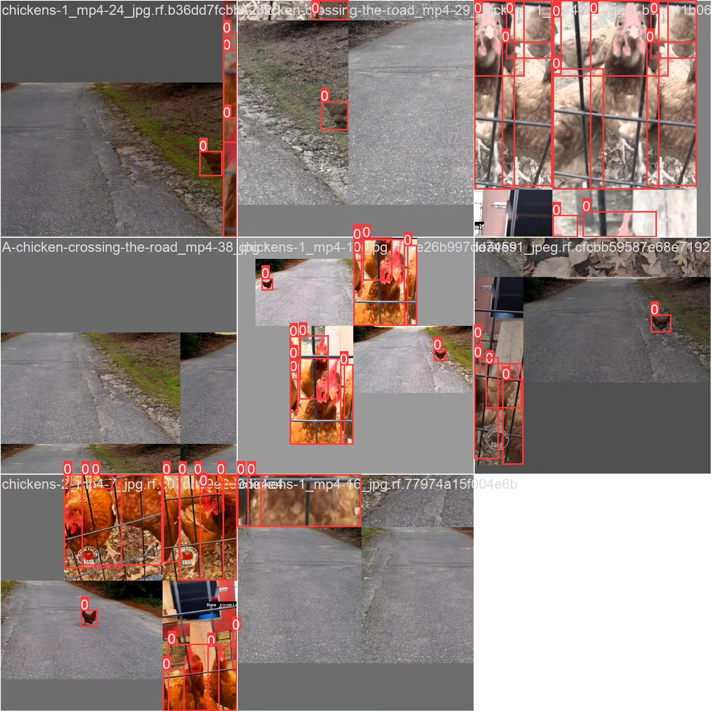
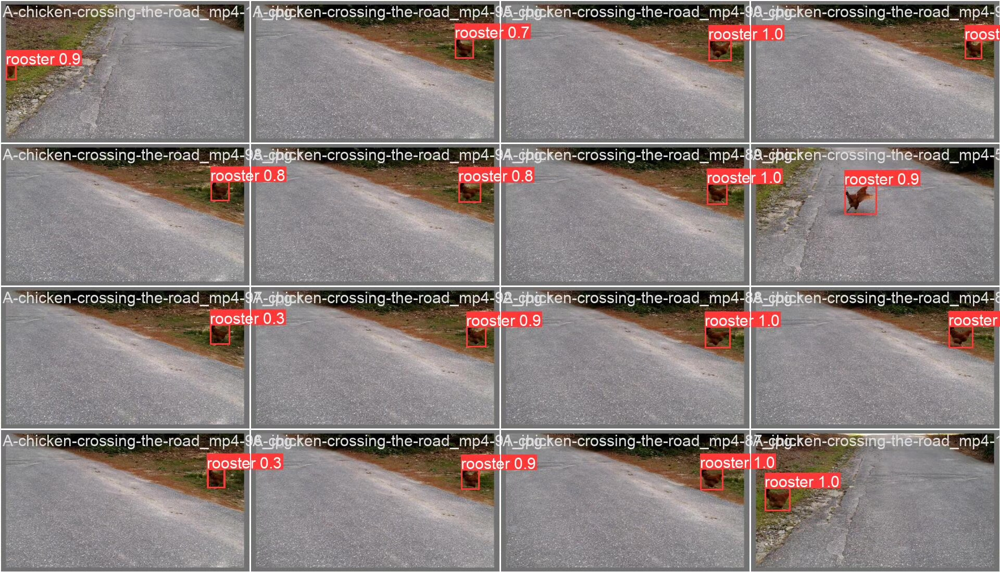

# Based on YOLOv10 deep learning for chicken detection system (YOLOv10+YO...

## Body

This research has developed a chicken detection and tracking system based on YOLOv10, focusing on the detection of a single category: rooster (chicken). The system aims to achieve real-time detection and tracking of chickens, suitable for scenarios such as farm management and behavioral studies. YOLOv10, as an efficient target detection model, can achieve real-time processing while ensuring high accuracy. This study constructs a dataset containing images of chickens, trains and optimizes the YOLOv10 model, and ultimately achieves high detection accuracy on the test set. In addition, combined with tracking algorithms (such as DeepSORT or ByteTrack), the system can achieve continuous tracking of chickens, providing technical support for automated management in farms.

The company's products have obtained YOLO official commercial license certification.

Package after-sales service: After payment, we will provide WeChat ID for any questions.

Environment configuration: A tutorial on environment configuration will be provided, and WeChat will provide answers to questions.

Remote installation service: If you need remote configuration, an additional fee of 69 is required, with all fees refunded if the configuration fails (only refunding installation fees for old computers).

Retraining dataset: Once the environment is configured, training can be done on your own computer. If you need us to retrain, just pay 69 plus computing power fees (2.5 yuan/hour).

Full after-sales service

## Images

## Payment

Here is a pay link on Stripe ( https://buy.stripe.com/3cs8yP7sY87d0vu9AB ). Please contact me lonlonago@foxmail.com after funding $89, and I will send you a complete data files , thank you!

